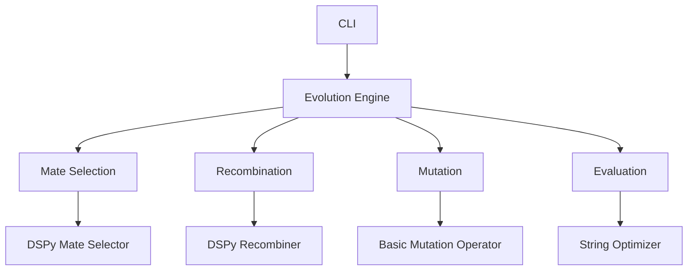

# Genetic LLM Agent Evolution Project Report

## Overview
Framework for evolving LLM-based agents through genetic algorithms, implementing:
- Chromosome-based agent architecture
- Modular evolutionary components
- Integration with DSPy for LLM-powered operations
- Extensible fitness evaluation system

## Key Features
[DONE] Implemented:
- Chromosome structure separating Task, Mate Selection, and Recombination logic
- Tournament selection and single-point crossover mechanisms
- DSPy-powered mate selection and recombination modules
- Basic CLI interface for running evolution cycles
- String optimization sample implementation
- Configurable mutation operator with basic implementation

🛠 In Progress:
- Dynamic chromosome type handling
- Comprehensive fitness evaluation pipeline
- Advanced mutation strategies
- Full DSPy integration validation

## Architecture Overview

## Implementation Status
| Component          | Progress | Notes                                  |
|--------------------|----------|----------------------------------------|
| Core Architecture  | 90%      | Stable chromosome/agent structure      |
| Evolution Engine   | 75%      | Needs more mutation strategies         |
| DSPy Integration   | 60%      | Basic LM integration complete          |
| CLI Interface      | 50%      | Functional but needs more options      |
| Test Coverage      | 65%      | Core components covered, CLI needs tests|

## Current Issues
1. Chromosome types hardcoded in multiple locations
2. Fitness evaluation not fully integrated in evolution loop
3. Limited mutation operator implementations
4. CLI lacks problem-specific configuration
5. Validation edge cases need better handling

## Test Coverage
**Core Components**: 82%  
**Evolution Engine**: 68%  
**DSPy Modules**: 45%  
**CLI**: 30%  

Key gaps:
- Mutation operator tests
- Chromosome validation scenarios
- Full evolution cycle integration tests
- CLI output validation

## Future Plans
1. Implement dynamic chromosome type registration
2. Add multi-objective fitness evaluation
3. Develop problem-specific CLI templates
4. Create advanced mutation operators:
   - Semantic preservation mutations
   - LLM-guided mutations
5. Add performance metrics tracking
6. Implement distributed evolution capabilities
